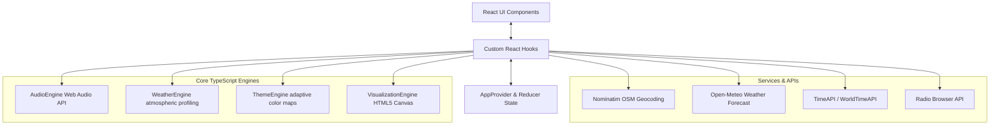

# 📻 WaveScape

[](https://vite.dev/)
[](https://react.dev/)
[](https://www.typescriptlang.org/)
[](https://tailwindcss.com/)
[](https://developer.mozilla.org/en-US/docs/Web/API/Web_Audio_API)
[](https://vitest.dev/)

**WaveScape** is a retro, ambient geolocation-driven radio receiver that adapts its visual theme, UI atmosphere, and particle rendering to the real-time weather and time of any searched city in the world. Powered by a custom Canvas visualization engine and the Web Audio API, WaveScape translates live audio streams into real-time visual waves, offering users a sensory portal to different locations around the globe.

---

## 🗺️ Architectural Design

WaveScape is built as a highly modular Single Page Application (SPA). Its architecture enforces a strict separation of concerns, decoupling the **UI Render Layer** (React), the **Global State Layer** (React Reducer/Context), the **System Hook Bindings** (Custom Hooks), and the **Programmatic Processing Engines** (Vanilla TS Singletons).



### 1. Global State & Context Layer
Located in [src/context/AppContext.tsx](file:///d:/WaveScape/src/context/AppContext.tsx), state is managed using React's native `useReducer` combined with `useContext`. This setup supplies global state (`useAppState`) and action dispatchers (`useAppDispatch`) to components. This avoids prop-drilling while maintaining a predictable state machine for loading, active locations, weather profiles, playback status, and raw audio metrics.

### 2. The Custom Hook Bindings
Hooks act as the intermediate controller layer, binding UI components to external data fetches and background engines:
*   [useLocation.ts](file:///d:/WaveScape/src/hooks/useLocation.ts): Wraps Nominatim queries. Implements abortable fetch requests to handle overlapping typing triggers.
*   [useRadio.ts](file:///d:/WaveScape/src/hooks/useRadio.ts): Connects React state to the `AudioEngine` event emitter system. Handles track jumping (`next`/`prev`), volume control, and dispatches real-time spectral analyzer data.
*   [useWeather.ts](file:///d:/WaveScape/src/hooks/useWeather.ts): Handles weather fetching and schedules periodic background updates (`WEATHER_REFRESH_INTERVAL` of 10 minutes) to update themes and clock offsets on active channels.
*   [useClock.ts](file:///d:/WaveScape/src/hooks/useClock.ts): Formats local time for any timezone offset, ticking independently to keep local dials accurate.
*   [useVisualization.ts](file:///d:/WaveScape/src/hooks/useVisualization.ts): Binds the HTML5 Canvas reference lifecycle to the visual rendering loop.
*   [useTuningTransition.ts](file:///d:/WaveScape/src/hooks/useTuningTransition.ts): Implements visual buffers during audio tuning to simulate a retro radio dialing connection sequence.

### 3. Programmatic Processing Engines
Decoupled from React, the engines are standalone TypeScript classes designed as singletons. They run core logic (animation ticks, Web Audio pipelines, and theme computations) outside of React's render loops:
*   **[AudioEngine.ts](file:///d:/WaveScape/src/audio/AudioEngine.ts)**: Configures the Web Audio graph. Calculates real-time spectral values.
*   **[WeatherEngine.ts](file:///d:/WaveScape/src/weather/WeatherEngine.ts)**: Formulates physical profiles from raw meteorological data.
*   **[ThemeEngine.ts](file:///d:/WaveScape/src/theme/ThemeEngine.ts)**: Maps weather states and local warmth factors into a Neobrutalist design system.
*   **[VisualizationEngine.ts](file:///d:/WaveScape/src/visualization/VisualizationEngine.ts)**: Handles the high-performance HTML5 Canvas animation loop.

---

## 🎨 Visual Design & Neobrutalist Aesthetic

WaveScape features a distinctive **Neobrutalist** design style. Key styling concepts in the project include:
*   **High Contrast & Hard Shadows**: Thick solid borders (`3px` to `5px` black) and heavy rectangular shadows (`shadow-[6px_6px_0px_rgba(0,0,0,1)]`) are applied to cards, search inputs, and buttons.
*   **Typography**: Clean font pairings using `Space Grotesk` for geometric header cards and `IBM Plex Mono` for code blocks, telemetry readouts, time dials, and stream metadata.
*   **Adaptive Palette Program**: Elements dynamically adjust using custom CSS variables (`--background`, `--surface`, `--text`, `--muted-text`, and `--accent`). These variables are modified in real-time by the theme engine, adapting colors to match the searched location's atmospheric conditions.
*   **Interactive Motion & Micro-Animations**:
    *   **Speaker Floating**: The central retro radio SVG floats using CSS keyframe translations (`animate-float`).
    *   **Tuning Flicker**: Visual feedback mimics CRT monitors (`animate-flicker` and `animate-scanline`).
    *   **Audio Bounce**: Real-time Bass and RMS energy levels dynamically scale the retro radio component using CSS Transform matrices via the `AudioEngine`'s calculated values.

---

## 🔌 API Services Breakdown

The application coordinates five free, open-access web APIs to resolve geolocation metadata, local time, weather metrics, and live audio streams:

| Service Name | Scope / Purpose | API Endpoint | Output Utilized |
| :--- | :--- | :--- | :--- |
| **Nominatim (OpenStreetMap)** | Geocoding & autocomplete search | `https://nominatim.openstreetmap.org/search` | Latitude, longitude, resolved display names, and city address blocks. |
| **Open-Meteo API** | Weather conditions & local timezones | `https://api.open-meteo.com/v1/forecast` | Current temperature, WMO weather codes, day/night status, wind speeds, and sunset/sunrise offsets. |
| **TimeAPI.io** | Local timezone calculations | `https://timeapi.io/api/Time/current/coordinate` | High-accuracy local time, timezone labels, and DST offsets. |
| **WorldTimeAPI** | Backup local time & timezone resolver | `https://worldtimeapi.org/api/timezone` | Failover timezone database and current local time strings. |
| **Radio Browser** | Crowd-sourced live stream directory | `https://de1.api.radio-browser.info/json` | Streaming URLs, station names, bitrates, audio codecs, tags, favicons, and coordinates. |

---

## 📍 Nearest Stations Search & Geolocation Fallback Algorithm

Finding the nearest 5 radio stations relative to the searched city uses a multi-tier fallback query system coupled with geodesic sorting.

### Three-Tier Cascading Fetch Logic
To minimize data consumption while ensuring that search results are always populated, the `fetchStationsByCoordinates` function in [radio.service.ts](file:///d:/WaveScape/src/services/radio.service.ts) queries the Radio-Browser API through a cascading three-tier system:

```
[Search Triggered]
       │
       ▼
┌──────────────────────────────────────────────┐
│ TIER 1: Regional Search (500 km radius)      │ ──► Found ≥ 5 stations? ──► [YES] ──┐
│ Fetch up to 200 top-voted geocoded stations  │                                     │
└──────────────────────────────────────────────┘                                     │
       │ [NO]                                                                        │
       ▼                                                                             ▼
┌──────────────────────────────────────────────┐                          ┌──────────────────────┐
│ TIER 2: Sub-continental Search (3,000 km)    │ ──► Found ≥ 5 stations? ──► [YES]│ Sort by Haversine    │
│ Expand radius to fetch 200 top-voted stations│                                  │ Distance and return  │
└──────────────────────────────────────────────┘                                  │ the nearest 5        │
       │ [NO]                                                                     └──────────────────────┘
       ▼                                                                             ▲
┌──────────────────────────────────────────────┐                                     │
│ TIER 3: Global Fetch                         │                                     │
│ Retrieve top 500 voted stations globally     │ ────────────────────────────────────┘
│ that contain valid coordinates               │
└──────────────────────────────────────────────┘
```

1.  **Tier 1 (Regional Search)**:
    Queries the API within a **500 km** radius (`geo_distance=500000`) centered on the target coordinates. It requests up to 200 highly-voted, active stations (`hidebroken=true`, `has_geo_info=true`). If this yields 5 or more stations containing coordinate data, the search cascade terminates.
2.  **Tier 2 (Sub-Continental Search)**:
    If Tier 1 yields fewer than 5 stations, the search radius is expanded to **3,000 km** (`geo_distance=3000000`) to find up to 200 stations, merging new items with the previous results while filtering duplicates.
3.  **Tier 3 (Global Search)**:
    If the target count is still under 5, the engine queries the top **500** active, geocoded stations globally. This ensures the UI is populated even when searching remote locations.

### Geodesic Sorting: The Haversine Formula
Once candidates are retrieved, all stations with valid latitude and longitude coordinates are sorted by distance from the search location. 

The physical distance $d$ between coordinates is computed using the **Haversine Formula**, which accounts for the Earth's spherical curvature:

$$a = \sin^2\left(\frac{\Delta \phi}{2}\right) + \cos(\phi_1)\cos(\phi_2)\sin^2\left(\frac{\Delta \lambda}{2}\right)$$

$$c = 2 \cdot \operatorname{atan2}(\sqrt{a}, \sqrt{1-a})$$

$$d = R \cdot c$$

Where:
*   $\phi_1, \phi_2$ are the latitudes of the search location and station in radians.
*   $\Delta \phi = \phi_2 - \phi_1$.
*   $\Delta \lambda = \lambda_2 - \lambda_1$ (difference in longitudes in radians).
*   $R$ is the Earth's mean radius ($6,371 \text{ km}$).
*   $d$ is the calculated great-circle distance.

This computation is implemented in [math.ts](file:///d:/WaveScape/src/utils/math.ts):

```typescript
export function haversineDistance(lat1: number, lon1: number, lat2: number, lon2: number): number {
  const R = 6371; // Earth's radius in kilometers
  const dLat = ((lat2 - lat1) * Math.PI) / 180;
  const dLon = ((lon2 - lon1) * Math.PI) / 180;
  const a =
    Math.sin(dLat / 2) ** 2 +
    Math.cos((lat1 * Math.PI) / 180) *
      Math.cos((lat2 * Math.PI) / 180) *
      Math.sin(dLon / 2) ** 2;
  return R * 2 * Math.atan2(Math.sqrt(a), Math.sqrt(1 - a));
}
```

The sorted list is sliced to return the top 5 nearest stations. In rare scenarios where fewer than 5 stations are geocoded, any available non-geocoded stations from the response are appended as fallback fillers to maintain layout consistency.

---

## ⚙️ Engine Technical Breakdown

### 🔊 Audio Engine
The [AudioEngine.ts](file:///d:/WaveScape/src/audio/AudioEngine.ts) singleton acts as the Web Audio manager, wrapping HTML5 audio streams:
*   **Node Graph Setup**: Connects an `HTMLAudioElement` source to a `MediaElementAudioSourceNode`. The stream passes through an `AnalyserNode` before reaching a `GainNode`, which connects to the destination speakers.
*   **Transition Ramp System**: To prevent audible clicks when switching stations, the gain node schedules a linear volume ramp to zero over $40\text{ms}$ before cleaning up old resources, then ramps back up to the target volume over $300\text{ms}$ once the new stream begins playing:
    ```typescript
    this.gainNode.gain.cancelScheduledValues(now);
    this.gainNode.gain.setValueAtTime(0, now);
    this.gainNode.gain.linearRampToValueAtTime(targetVolume, now + 0.3);
    ```
*   **Signal Processing**: Frequency and waveform arrays are analyzed during play cycles using `requestAnimationFrame`. Frequencies are divided into frequency bands to calculate real-time metrics:
    *   **Bass Range** (First 10% of frequency bins): Exposes low-end beats to drive scale animations.
    *   **Mids Range** (10% to 50% of frequency bins): Matches vocal ranges.
    *   **Treble Range** (50% to 100% of frequency bins): Captures high-frequency harmonics.
    *   **RMS** (Root Mean Square): Represents the overall average intensity of the audio signal.

### 🌤️ Weather Engine
The [WeatherEngine.ts](file:///d:/WaveScape/src/weather/WeatherEngine.ts) translates numerical WMO weather codes into visual metadata:
*   **WMO Weather Codes**: Maps codes (e.g., $0$ for clear skies, $51\text{--}55$ for drizzle, $95\text{--}99$ for thunderstorms) to weather states.
*   **Dynamic Visual Profiles**: Configures rendering details based on the active weather state:
    *   *Rain/Storm*: High density ($60\text{--}80$ particles), fast falling speed, and linear gray-blue backgrounds.
    *   *Snow*: Medium density ($40$ particles), slower drift speed, and cool blue-purple backgrounds.
    *   *Haze/Fog*: Low speed, larger particle size, low opacity, and soft gray-blue backdrops.
    *   *Clear Night*: Twinkling star particle layouts with radial dark-indigo background gradients.

### 🎨 Theme Engine
The [ThemeEngine.ts](file:///d:/WaveScape/src/theme/ThemeEngine.ts) programmatically adjusts UI colors based on localized weather conditions:
*   **Warmth Adjustments**: Adjusts the primary accent color using the local temperature. It maps the Celsius value to a warmth factor range ($[0, 1]$), blending the base hex value with warmer red tones or cooler blue tones:
    ```typescript
    private adjustAccent(hex: string, warmth: number): string {
      const r = parseInt(hex.slice(1, 3), 16);
      const g = parseInt(hex.slice(3, 5), 16);
      const b = parseInt(hex.slice(5, 7), 16);
      const wr = Math.round(r + (255 - r) * warmth * 0.3);
      const wg = Math.round(g + (255 - g) * warmth * 0.1);
      const wb = Math.round(b - b * warmth * 0.2);
      return `#${((wr << 16) | (wg << 8) | wb).toString(16).padStart(6, '0')}`;
    }
    ```
*   **Glow Adjustments**: Calculates box-shadow glows depending on temperature and active weather states (e.g., higher glow values during thunderstorms or hot days, lower values in fog).

### 🖥️ Visualization Engine
The Canvas visualizer in [VisualizationEngine.ts](file:///d:/WaveScape/src/visualization/VisualizationEngine.ts) renders visual layers to match the active weather:
*   **Background Gradients**: Radial gradients blend CSS background and surface variables across the viewport.
*   **CRT Simulated Grain Overlay**: Generates a low-resolution ($64 \times 36$) pixel noise array every frame, rendering it stretched over the canvas to create a retro analog CRT monitor texture.
*   **Adaptive Weather Particles**: Updates and draws array-based particle systems (snowflakes, raindrops, stars, haze particles) dynamically. Particle speeds and directions are affected by local wind data and audio amplitudes.
*   **Glow Waveform**: Renders a central glowing waveform. The line's vertical displacement is determined by the `AudioEngine`'s current time-domain array, while its glow intensity adapts in real-time to bass frequencies.

---

## 📁 Directory Structure

```
WaveScape/
├── public/                 # Static asset assets
│   ├── icons/              # Weather & radio retro SVG illustrations
│   └── fonts/              # Custom font packages (Space Grotesk, IBM Plex Mono)
├── src/
│   ├── App.tsx             # Application entry shell & layout structure
│   ├── main.tsx            # DOM mounting and bootstrap setup
│   ├── index.css           # Global layout variables & default theme rules
│   ├── animations/         # Custom animation utilities
│   ├── audio/              # HTML5 Web Audio Engine singleton
│   ├── components/         # Modular layout blocks (cards, search, playback control)
│   ├── constants/          # Application configs, WMO codes, and API URLs
│   ├── context/            # React Context Provider & Reducer State definitions
│   ├── hooks/              # Custom React state hooks
│   ├── services/           # Abortable HTTP service requests for APIs
│   ├── styles/             # Global CSS & Neobrutalist styling configurations
│   ├── theme/              # Dynamic Theme Engine class
│   ├── types/              # Unified TypeScript interface definitions
│   ├── utils/              # Debounce, color transformations, and math calculations
│   └── visualization/      # High-performance Canvas visualizer loop
└── tsconfig.json           # Compiler rules and settings
```

---

## 🚀 Installation & Local Development

Follow these steps to set up the project locally.

### Prerequisites
*   **Node.js**: `v20.x` or higher recommended.
*   **npm** or **yarn**.

### Step-by-Step Setup
1.  **Clone the Repository**:
    ```bash
    git clone https://github.com/your-username/wavescape.git
    cd wavescape
    ```
2.  **Install Dependencies**:
    ```bash
    npm install
    ```
3.  **Run Development Server**:
    ```bash
    npm run dev
    ```
    This spins up a local dev server at `http://localhost:5173`.
4.  **Production Compilation**:
    ```bash
    npm run build
    ```
    Compiles TypeScript files and exports optimized bundle chunks to the `/dist` directory.
5.  **Local Preview**:
    ```bash
    npm run preview
    ```
    Serves the production build locally.

---

## 🧪 Unit and Integration Testing

WaveScape uses **Vitest** for running its test suite. Tests are located in files ending in `.test.ts` within the `services/` and `utils/` directories.

*   To run the test suite:
    ```bash
    npm run test
    ```
*   To run tests once without file watching:
    ```bash
    npm run test:run
    ```

### Test Methodology
*   **API Service Mocking**: Tests for `radio.service.ts` and `time.service.ts` mock network requests in [api.ts](file:///d:/WaveScape/src/services/api.ts) using `vi.mock` to verify fallback behaviors across Tiers 1, 2, and 3 without triggering actual API rate limits.
*   **Mathematical Assertions**: Verifies coordinates and distance sorting calculations against expected outputs from the Haversine formula.
